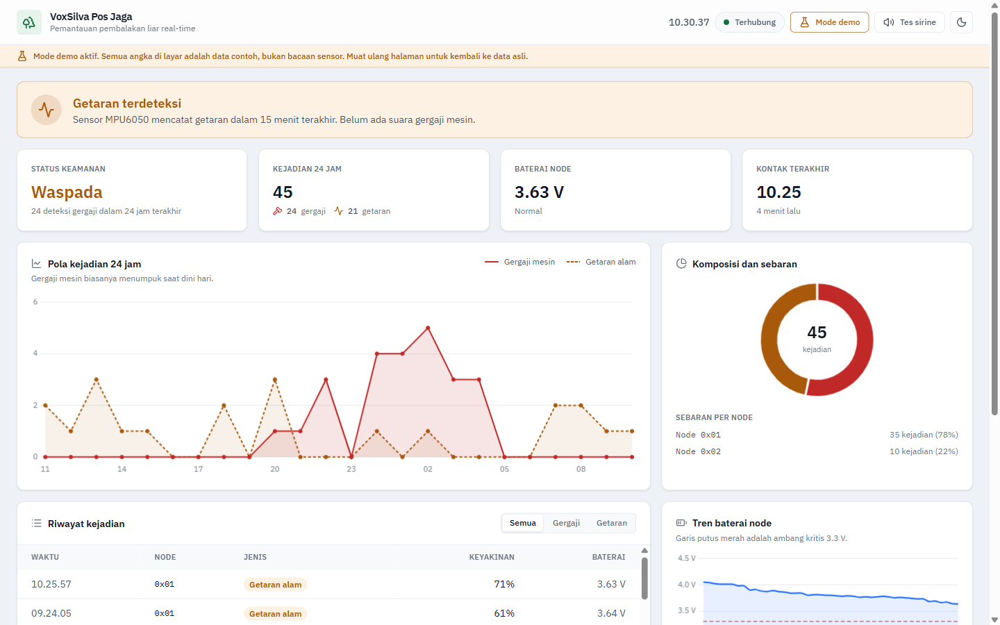
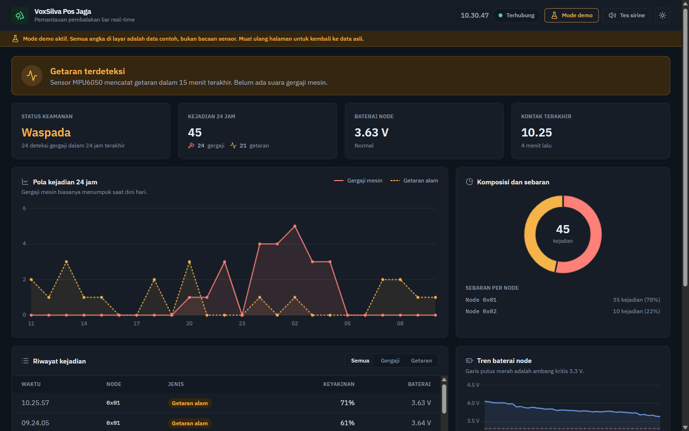

# VoxSilva - Guard Post Dashboard


## Overview

A real-time monitoring wall for the VoxSilva illegal-logging detection system, built for the laptop
that sits in a forest guard post (*pos jaga*). Solar-powered ESP32 nodes classify chainsaw audio with
TinyML and detect tree vibration with an MPU6050, relay each event over LoRa to a gateway ESP32,
which pushes it to Firebase Realtime Database. This dashboard renders that stream in under a second,
turns 24 hours of it into charts an operator can read at a glance, and raises a siren loud enough to
cross the room when a chainsaw is heard.

The interface follows High-Performance HMI practice (ISA-101 and EEMUA 191): a quiet neutral canvas
where color is reserved for abnormal conditions only. An operator learns to read a screen with no
color as "the forest is fine", which makes a single red panel impossible to miss.

## Tech Stack

| Layer | Choice |
|-------|--------|
| Build tool | Vite 8, ES modules, hashed asset output |
| Styling | Tailwind CSS 4 via `@tailwindcss/vite`, themed with CSS custom properties |
| Charts | Chart.js 4, tree-shaken to the line and doughnut controllers only |
| Data | Firebase Realtime Database, modular Web SDK v12 |
| Typography | IBM Plex Sans and IBM Plex Mono, self-hosted through Fontsource |
| Icons | Lucide, tree-shaken to the 16 icons actually in use |
| Audio | Web Audio API oscillator, so there is no siren MP3 to host or lose |
| Tests | `node:test` and `node:assert` from the standard library |
| Hosting | Firebase Hosting |

## Features

**Live monitoring**

- Sub-second updates over the Realtime Database socket, not polling.
- Status ribbon with three states: forest calm, vibration detected, chainsaw alarm. The chainsaw
  state raises a red banner, breathing background, and siren, and it cannot be downgraded by a later
  vibration event until an officer acknowledges it.
- Replay guard: the last 24 hours load as history on page open, but only events younger than 60
  seconds are allowed to sound the siren.

**Metrics and charts**

- Four headline metrics in the top row, ordered by how urgently an operator needs them: security
  status, events in 24 hours, node battery, last contact.
- 24-hour pattern chart plotting chainsaw against natural vibration per hour, which is where the
  illegal-logging pattern becomes visible (activity clusters between 00:00 and 05:00).
- Composition doughnut plus a per-node breakdown, so the busiest node is identifiable once more than
  one node is deployed.
- Battery trend line with the 3.3 V critical threshold drawn in, answering when a node must be
  visited rather than just what it reads now. Parked behind `VITE_BATTERY_MONITORING` until the
  hardware exists, because the firmware currently transmits a hardcoded 3.8 V placeholder.
- Periodic heartbeat (`0xCC`) counted as telemetry, never as an incident: it keeps battery readings
  and proof-of-life flowing while the forest is quiet, and it is what makes silence meaningful.
- Filterable event log, newest first, capped at 100 rows so an overnight shift cannot exhaust memory.
- Dates where they resolve ambiguity, nowhere else. The 24-hour window always crosses midnight, so
  rows from an earlier day carry a "Kemarin" label under the time while today's rows stay bare, and
  every timestamp exposes the full date on hover. The header carries a live date and clock.

**Operating the dashboard**

- Light theme by default with a night-shift dark toggle, remembered per browser. Both themes are
  driven by one set of CSS custom properties, so charts recolor without a second palette to maintain.
- Demo mode fills the dashboard with a reproducible 24-hour sample story for presentations. It lives
  in memory only, is never written to Firebase, is marked by a banner that cannot be missed, and
  drops itself the moment a real alert arrives.
- Composed empty states on every chart and table, so a quiet night reads as calm rather than broken.
- Keyboard skip link, live regions on the status ribbon and connection badge, `prefers-reduced-motion`
  honored, and WCAG AA contrast verified in both themes.

**Data handling**

- Every device field is validated, clamped, and rendered as text, never as HTML.
- Missing readings render as `--`, never as a confident `0.00 V`.
- Configuration comes from `.env` alone. No in-page credential form and no browser-stored override,
  so what a guard post is watching cannot be changed without a rebuild.

## Interface Design Notes

- **Color is state, never decoration.** Red means a chainsaw was heard, amber means vibration, green
  means normal. The interactive blue used by buttons and focus rings is deliberately outside that
  scale so it can never be mistaken for an alarm.
- **Layout follows the scanning pattern.** The most critical metric sits top left, secondary metrics
  run across the top row, and diagnostic detail (charts, log, node specs) fills the lower half.
- **Integer counts are drawn with straight lines.** The 24-hour chart uses no curve smoothing, since
  a spline through hourly counts would draw fractional events at minutes when nothing happened.
- **Numbers use tabular figures** so a reading that updates in place does not shift on screen.
- **The interface never claims more than the sensors know.** The MPU6050 reports movement, not its
  cause, so its events read "Getaran pohon" rather than naming a culprit. Battery arrives as
  volts x 10 in a single byte, so it renders to one decimal. Vibration and heartbeat rows show `--`
  for confidence because no classifier ran.

## Prerequisites

- Node.js 20.19+ or 22+ (`node -v`)
- npm 10+
- A Firebase project with Realtime Database enabled
- Firebase CLI, for deployment only: `npm install -g firebase-tools`

## Installation

1. Install dependencies:

   ```bash
   cd dashboard
   npm install
   ```

2. Create your environment file from the template:

   ```bash
   cp .env.example .env
   ```

3. Fill `.env` with the Database URL and Web API key from **Firebase Console → Project settings**.

4. Start the dev server:

   ```bash
   npm run dev
   ```

5. Publish the database rules, which both authorize the ESP32 gateway to write and create the
   `timestamp` index the 24-hour queries need:

   ```bash
   firebase login
   firebase use --add          # pick your Firebase project
   npm run deploy:rules
   ```

## Environment Variables

Vite only exposes variables prefixed with `VITE_`, and it inlines them into the built JavaScript.
Treat both as public values and rely on the database rules for protection rather than on secrecy.

| Variable | Description | Example | Required |
|----------|-------------|---------|----------|
| `VITE_FIREBASE_DATABASE_URL` | Realtime Database instance the dashboard subscribes to | `https://voxsilva-forest-default-rtdb.asia-southeast1.firebasedatabase.app` | Yes |
| `VITE_FIREBASE_API_KEY` | Firebase Web API key, needed once you add Firebase Auth to the project | `AIzaSyD-ExampleKeyReplaceWithYourOwn0000000` | No |
| `VITE_BATTERY_MONITORING` | `on` once the node's battery divider exists, `off` otherwise | `off` | No |

Without `VITE_FIREBASE_DATABASE_URL` the dashboard still loads and reports *"Belum dikonfigurasi"*,
so a misconfigured guard post fails loudly instead of looking calm and empty.

## Usage / Quick Start

```bash
npm run dev            # dev server with hot reload at http://localhost:5173
npm test               # payload and statistics tests (node:test, no framework)
npm run build          # production bundle into dist/
npm run preview        # serve dist/ exactly as Firebase Hosting will
npm run deploy         # build, then deploy hosting
npm run deploy:rules   # deploy database.rules.json only
```

**Demo mode.** Click *Mode demo* in the header to fill every metric and chart with a reproducible
24-hour sample. The seeded generator produces the same story on every run, so a presentation does not
change halfway through an explanation. Reload the page, or wait for a real alert, to return to live data.

**Night shift.** The moon icon in the header switches to the dark theme and remembers the choice in
that browser.

**Simulating an alert without hardware.** Available in `npm run dev` only, stripped from production
builds. Open the browser console and run:

```js
__voxsilva.simulate('CHAINSAW');   // red alarm ribbon plus siren
__voxsilva.simulate('VIBRATION');  // amber warning
__voxsilva.demo();                 // same as the Mode demo button
```

**Pointing at another Firebase project.** Edit `.env` and rebuild. There is deliberately no in-page
settings form and no `localStorage` override: one build targets one database, so a guard post cannot
be silently repointed from the browser.

## API Documentation

There is no HTTP API of our own. The contract is the shape of the data written to Realtime Database.

**Write path** (ESP32 gateway, `pos_jaga.ino`): `POST https://<database-url>/alerts.json`

```json
{
  "node_id": "0x01",
  "alert_type": "CHAINSAW",
  "alert_code": "0xAA",
  "confidence": 99,
  "battery": 3.80,
  "timestamp": { ".sv": "timestamp" }
}
```

| Field | Type | Notes |
|-------|------|-------|
| `node_id` | string | Forest node identifier, max 12 characters |
| `alert_type` | string | `CHAINSAW`, `VIBRATION`, `HEARTBEAT`, or `UNKNOWN`; anything else is rejected by the rules |
| `alert_code` | string | `0xAA` chainsaw, `0xBB` vibration, `0xCC` heartbeat |
| `confidence` | number | TinyML confidence, 0 to 100. Only meaningful for `CHAINSAW`; the other types send a constant, so the dashboard renders them as `--` |
| `battery` | number | Node battery volts, 0 to 10 |
| `timestamp` | number | Use Firebase's `{".sv": "timestamp"}` so the server clock wins over drifting device clocks |

**Read path** (dashboard): subscribes to `/alerts` ordered by `timestamp`, starting 24 hours back, and
receives each new child as it lands. That query requires `".indexOn": ["timestamp"]`, which is already
declared in `database.rules.json` and must be deployed before the dashboard can read efficiently.

**Rules** (`database.rules.json`): the root is closed. `/alerts` is world-readable and writes are
create-only, so a client may add a new alert but cannot modify or delete an existing one, and the
payload must match the table above. The guard-post display has no login, which is why reads are open.
If the deployment ever needs to be private, add Firebase Auth and change `/alerts/.read` to
`auth != null`.

## Project Structure

```text
dashboard/
├── index.html            # Single page shell; markup only, no inline scripts
├── src/
│   ├── main.js           # Firebase subscription, rendering, theme, demo mode, siren
│   ├── alert.js          # Pure payload normalizer, the trust boundary for device data
│   ├── alert.test.js     # Coverage for malformed and hostile payloads
│   ├── stats.js          # Pure aggregations: hourly buckets, composition, battery, node health
│   ├── stats.test.js     # Coverage for every aggregation and threshold
│   ├── datetime.js       # Date and time formatting, calendar-day aware
│   ├── datetime.test.js  # Coverage for midnight, month and year boundaries
│   ├── charts.js         # Chart.js setup; reads colors from CSS custom properties
│   ├── demo.js           # Seeded 24-hour sample generator, memory only
│   └── style.css         # Design tokens for both themes, fonts, alarm keyframes
├── docs/                 # README screenshots
├── vite.config.js        # Vite plus Tailwind plugin, sourcemaps on
├── firebase.json         # Hosting (serves dist/) and database rules wiring
├── database.rules.json   # Create-only, schema-validated write rules and the timestamp index
├── .env.example          # Template for the two VITE_ variables
└── package.json          # Scripts: dev, build, preview, test, deploy
```

`.firebaserc` is intentionally absent; `firebase use --add` writes it with your own project ID.

## Screenshots

Both screenshots show the dashboard in demo mode, which is why the charts are populated.

**Light theme, day shift**



**Dark theme, night shift**



## Contributing

1. Fork the repository and branch from `main`: `git checkout -b feat/node-map`.
2. Keep the conventions already in the code: ES modules, 2-space indent, single quotes,
   Indonesian UI copy and code comments, English documentation.
3. Keep aggregation logic pure and in `src/stats.js`, with a case in `src/stats.test.js`. Anything
   that parses device payloads gets a case in `src/alert.test.js`.
4. Colors belong in `src/style.css` as tokens. Never write a hex value into a component or a chart.
5. Run `npm test && npm run build` before pushing.
6. Open a pull request describing the field scenario the change addresses.

## License

MIT. Use it, modify it, deploy it at your own guard post.
